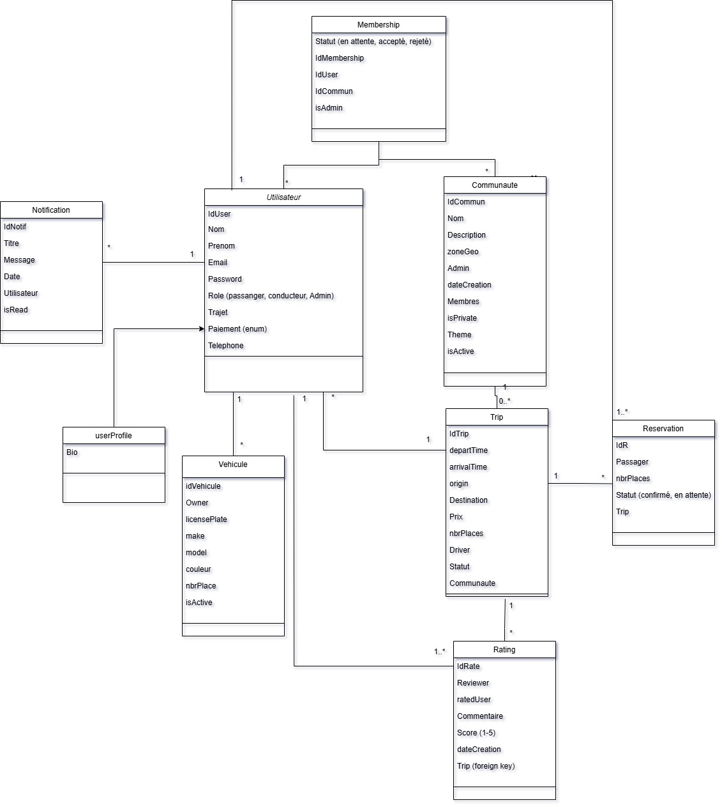

# EcoTrajet - Plateforme de Transport durable

## 📋 Présentation

EcoTrajet est une plateforme innovante de transport collaboratif qui permet aux utilisateurs de créer et participer à des communautés locales pour optimiser leurs déplacements quotidiens. Notre solution vise à faciliter le covoiturage et à créer des liens sociaux autour de la mobilité durable.

## 👥 Notre Équipe

| Membre | Rôle | Responsabilités |
|--------|------|-----------------|
| Sirine Hjaij | Chef de Projet & Développeuse | • Setup initial du projet<br>• Gestion des trajets<br>• Gestion des reservations |
| Hayder Chakroun | Développeur Backend | • Configuration de la base de données<br>• Système d'authentification<br>• Sécurité des données |
| Ahmed Ben Said | Développeur Full-Stack | • Développement interface utilisateur<br>• Système de notifications |
| Yassine Gomriani | Développeur Backend | • Gestion des communautés<br>• Système de membership |
| Hanoune Camara | Développeur Backend | • Système d'évaluation (Rating)<br>• Gestion des véhicules|
| Yassine Ali | Développeur Backend | • Gestion des profils utilisateurs<br>• API des utilisateurs|




### 📊 Répartition des Tâches

#### Sirine Hjaij
- [x] Initialisation du projet et structure
- [x] Système de gestion des trajets
- [x] Système de gestion des reservations
- [x] Documentation technique

#### Hayder Chakroun
- [x] Mise en place de la base de données PostgreSQL
- [x] Implémentation du système d'authentification
- [x] Sécurisation des endpoints API

#### Ahmed Ben Said
- [x] Développement de l'interface utilisateur React
- [x] Système de notifications en temps réel
- [x] Intégration frontend-backend
  - Connexion des interfaces aux API (Axios/Fetch)
  - Liaison des composants React avec le backend

#### Yassine Gomriani
- [x] Création et gestion des communautés
- [x] Système d'adhésion aux communautés
- [x] Tableau de bord communautaire

#### Hanoune Camara
- [x] Système d'évaluation des utilisateurs
- [x] Gestion des véhicules

#### Yassine Ali
- [x] Gestion des profils utilisateurs
- [x] API de gestion des utilisateurs

### 🔄 Workflow de l'Équipe

Notre équipe suit une méthodologie de développement collaborative :

#### 📅 Organisation Quotidienne
- **Daily Meetings sur Google Meet**
  - Point quotidien sur l'avancement des tâches
  - Prise de décisions collectives
  - Résolution des conflits techniques
  - Synchronisation entre les membres de l'équipe

#### 👨‍💻 Processus de Développement
- Revue de code via pull requests
- Documentation continue
- Tests unitaires et d'intégration
- Résolution collaborative des problèmes techniques

#### 🛠 Outils de Collaboration
- Google Meet pour les réunions quotidiennes
- GitHub pour la gestion du code source
- WhatsApp pour la communication rapide
- Git pour le versioning

## 🚀 Fonctionnalités Principales

### 👥 Gestion des Utilisateurs
- Inscription et connexion sécurisée
- Gestion des rôles (conducteur/passager)
- Profils personnalisés avec préférences de trajet
- Gestion des véhicules

### 🌍 Système de Communautés
- Création et gestion de communautés thématiques
- Administration des membres
- Filtrage par zone géographique

### 🚗 Gestion des Trajets
- Publication de trajets avec détails complets
- Système de réservation en temps réel
- Recherche avancée par communauté
- Gestion des places disponibles

### ⭐ Système d'Évaluation
- Notation après chaque trajet
- Historique des évaluations
- Commentaires et retours d'expérience

### 🔔 Notifications
- Alertes pour nouveaux trajets
- Rappels de réservations
- Notifications de communauté

## 🏗 Architecture du Projet

```
EcoTrajet/
├── backend/ (Django + DRF)
│   ├── EcoTrajet/               # Main Django project
│   │   ├── settings.py          # Global settings
│   │   ├── urls.py              # Root URL routing
│   │   └── ...
│   │
│   ├── api/                     # Core API logic
│   │   ├── models/              # Shared models (e.g., Travel, Routes)
│   │   ├── serializers.py
│   │   ├── views.py
│   │   └── urls.py
│   │
│   └── user_management/         # Auth & user handling
│       ├── models.py            # Custom User model
│       ├── serializers.py       # Auth serializers
│       ├── views.py             # Login/Register/Profile
│       ├── urls.py              # auth/ routes
│       └── tests/
│
└── frontend/ (React)
    ├── public/                  # Static files
    ├── src/
    │   ├── auth/               # Auth components (Login/Register)
    │   ├── api/                # Axios/API calls
    │   ├── pages/              # Routes (Dashboard, Profile)
    │   ├── App.js              # Main router
    │   └── ...
    └── package.json
```

## 🛠 Technologies Utilisées

### Backend
- Python 3.8+
- Django/Django REST Framework
- PostgreSQL
- JWT Authentication

### Frontend
- React.js
- Tailwindcss
- Vite.js
- Lucide React for icons
- axios
- react router dom 

### Outils & Infrastructure
- GitHub Actions (CI/CD)

## 📦 Modules & Entités

### Principales Entités
- Utilisateur
- Communauté
- Trajet
- Réservation
- Évaluation
- Notification

## 📝 Prérequis

- Python 3.8 ou supérieur
- Node.js 14 ou supérieur
- PostgreSQL

## ⚡ Démarrage Rapide

1. **Cloner le dépôt**
```bash
git clone https://github.com/sirinehj/EcoTrajet-FullStack.git
cd EcoTrajet-FullStack
```

2. **Configuration de l'environnement**
```bash
# Backend
cd backend
python -m venv venv
source venv/bin/activate  # Unix
.\venv\Scripts\activate   # Windows
pip install -r requirements.txt

# Créer le fichier .env
cp .env.example .env
```

3. **Configuration de la base de données**
```bash
python manage.py migrate
python manage.py createsuperuser
```

4. **Lancer l'application**
```bash
# Backend
python manage.py runserver

# Frontend
cd ../frontend
:: Install dependencies
npm install

:: Install Tailwind CSS
npm install -D tailwindcss@^3 postcss autoprefixer

:: Install Lucide React for icons
npm install lucide-react

:: Initialize Tailwind
npx tailwindcss init -p

:: Install axios
npm install axios

:: Install react router fom 
npm install react-router-dom

npm run dev

```

5. **Accéder à l'application**
- Frontend: http://localhost:5173
- API Backend: http://localhost:8000
- Administration: http://localhost:8000/admin

## 🤝 Contribution

Les contributions sont les bienvenues! Veuillez suivre ces étapes:
1. Forker le projet
2. Créer une branche pour votre fonctionnalité
3. Commiter vos changements
4. Pousser vers la branche
5. Ouvrir une Pull Request

## 📝 License

Ce projet est sous licence MIT.
